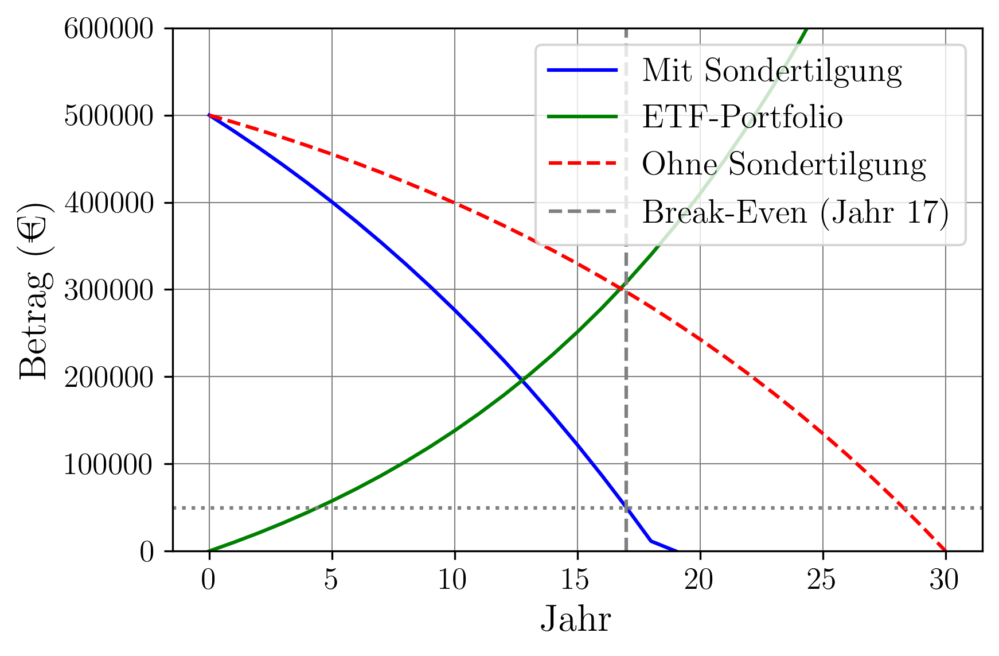

# 💸 Kredit vs. ETF – Finanzielle Entscheidungsanalyse in Python

Dieses Projekt vergleicht zwei Strategien zur Rückzahlung eines Immobilienkredits:

1. **Sondertilgung**: Zusätzliche 10.000 € pro Jahr zur schnelleren Rückzahlung.
2. **ETF-Investition**: Statt der Sondertilgung wird jährlich in ein ETF-Portfolio investiert.

Das Ziel ist es, herauszufinden, welche Strategie langfristig vorteilhafter ist – in Bezug auf Restschuld, Vermögensaufbau und Break-Even-Zeitpunkt.

---

## 🧮 Funktionen

* **Annuitätsberechnung** für ein Annuitätendarlehen
* **Zins- und Tilgungsberechnung** mit und ohne Sondertilgung
* **ETF-Investitionssimulation** mit konstantem jährlichem Beitrag und Wachstumsrate
* **Break-Even-Analyse**: Wann übersteigt das ETF-Portfolio die Restschuld?
* **Visualisierung** der beiden Strategien mit Matplotlib
* **Netto-Vermögensvergleich** am Ende der Laufzeit

---

## 📈 Beispielhafte Visualisierung

Es wird ein Plot `kredit.png` generiert, der die Entwicklung von:

* Restschuld mit Sondertilgung
* Restschuld ohne Sondertilgung
* ETF-Portfolio

zeigt. Der Break-Even-Punkt wird im Diagramm hervorgehoben. Siehe Beispiel:



---

## 🛠️ Voraussetzungen

### Python-Pakete

Folgende Bibliotheken werden verwendet:

```bash
numpy
matplotlib
numpy_financial
```

Installation (falls nötig):

```bash
pip install numpy matplotlib numpy-financial
```

---

## ▶️ Nutzung

```bash
python kredit_vs_etf.py
```

Ergebnisse werden in der Konsole angezeigt und als Plot gespeichert (`kredit.png`).

---

## 🔧 Parameter (anpassbar im Code)

| Parameter          | Beschreibung                                  | Beispielwert  |
| ------------------ | --------------------------------------------- | ------------- |
| `kreditsumme`      | Gesamthöhe des Kredits                        | 500\_000 €    |
| `zinssatz_kredit_` | Nominalzins des Kredits pro Jahr              | 0.025 (2,5 %) |
| `tilgung_prozent`  | Anfangstilgung pro Jahr                       | 0.02 (2 %)    |
| `laufzeit`         | Geplante Laufzeit in Jahren                   | 30            |
| `zusatz_geld`      | Jährliche Sonderzahlung bzw. ETF-Investition  | 10\_000 €     |
| `etf_rendite`      | Erwartete Rendite des ETF-Portfolios pro Jahr | 0.07 (7 %)    |

---

## 📄 Ergebnisse (Beispielausgabe)

```text
Reguläre Annuität: 26.395,49 € pro Jahr
Mit Sondertilgung: Kredit abbezahlt in Jahr 17
Ohne Sondertilgung: Kredit abbezahlt in Jahr 30
Break-Even-Point in Jahr 25:
  - Restschuld mit Sondertilgung: 52.345,76 €
  - ETF-Portfolio: 55.123,89 €
Netto-Vermögen nach 30 Jahren:
Mit Sondertilgung: 0,00 €
Mit ETF-Investition: 122.456,78 €
```

---

## 👨‍💻 Autor

Diyar Altinses, M.Sc.

---

## 📜 Lizenz

Dieses Projekt steht unter der **MIT-Lizenz**. Frei zur Nutzung, Modifikation und Weitergabe mit Namensnennung.

