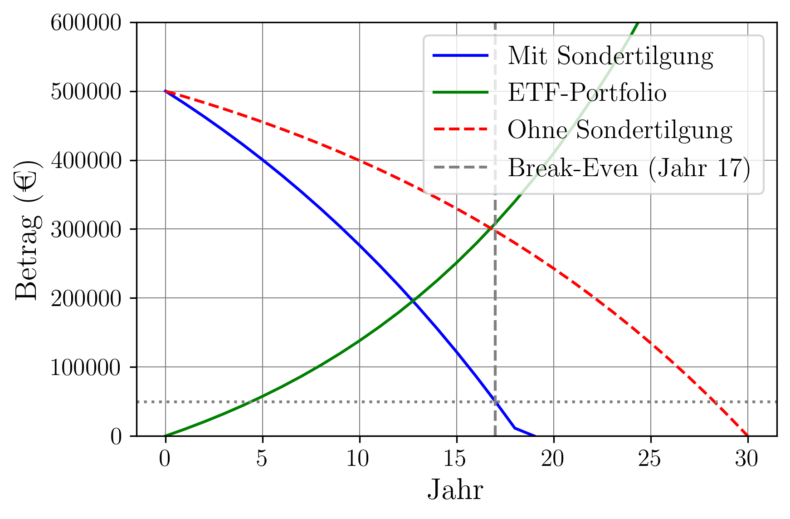

# 💸 Loan vs. ETF – Financial Decision Analysis in Python

This project compares two strategies for repaying a mortgage:

1. **Extra Repayment**: An additional €10,000 per year is used to pay off the loan faster.
2. **ETF Investment**: Instead of extra repayments, €10,000 is invested annually into an ETF portfolio.

The goal is to determine which strategy is more beneficial in the long run – in terms of remaining debt, asset growth, and the break-even point.

---

## 🧮 Features

* **Annuity calculation** for a mortgage loan
* **Interest and repayment simulation** with and without extra repayments
* **ETF investment simulation** with fixed annual contributions and a growth rate
* **Break-even analysis**: When does the ETF portfolio surpass the remaining debt?
* **Visualization** of both strategies using Matplotlib
* **Net worth comparison** at the end of the loan period

---

## 📈 Example Visualization

A plot named `kredit.png` is generated, showing the development of:

* Remaining debt with extra repayments
* Remaining debt without extra repayments
* ETF portfolio value

The break-even point is highlighted in the chart. See example below:



---

## 🛠️ Requirements

### Python packages

The following libraries are used:

```bash
numpy  
matplotlib  
numpy_financial  
```

Installation (if needed):

```bash
pip install numpy matplotlib numpy-financial
```

---

## ▶️ Usage

```bash
python kredit_vs_etf.py
```

Results will be displayed in the terminal and saved as a plot (`loan.png`).

---

## 🔧 Parameters (adjustable in the code)

| Parameter          | Description                                 | Example Value |
| ------------------ | ------------------------------------------- | ------------- |
| `kreditsumme`      | Total loan amount                           | €500,000      |
| `zinssatz_kredit_` | Annual nominal interest rate                | 0.025 (2.5%)  |
| `tilgung_prozent`  | Initial annual repayment rate               | 0.02 (2%)     |
| `laufzeit`         | Planned duration in years                   | 30            |
| `zusatz_geld`      | Annual extra payment or ETF investment      | €10,000       |
| `etf_rendite`      | Expected annual return of the ETF portfolio | 0.07 (7%)     |

---

## 📄 Results (Example Output)

```text
Regular annuity: €26,395.49 per year  
With extra repayment: Loan paid off in year 17  
Without extra repayment: Loan paid off in year 30  
Break-even point in year 25:  
  - Remaining debt with extra repayment: €52,345.76  
  - ETF portfolio: €55,123.89  
Net worth after 30 years:  
With extra repayment: €0.00 (loan paid off)  
With ETF investment: €122,456.78 (ETF - remaining debt)  
```

---

## 👨‍💻 Author

Diyar Altinses, M.Sc.

---

## 📜 License

This project is licensed under the **MIT License**. Free to use, modify, and distribute with attribution.

---

